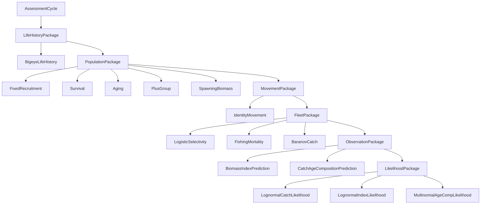

# CAA Architecture Diagram

Generated from `CAA_IR.json`.

```mermaid
flowchart TD
  AssessmentCycle[AssessmentCycle]
  AssessmentCycle --> LifeHistoryPackage
  LifeHistoryPackage --> BigeyeLifeHistory
  LifeHistoryPackage --> PopulationPackage
  PopulationPackage --> FixedRecruitment
  PopulationPackage --> Survival
  PopulationPackage --> Aging
  PopulationPackage --> PlusGroup
  PopulationPackage --> SpawningBiomass
  PopulationPackage --> MovementPackage
  MovementPackage --> IdentityMovement
  MovementPackage --> FleetPackage
  FleetPackage --> LogisticSelectivity
  FleetPackage --> FishingMortality
  FleetPackage --> BaranovCatch
  FleetPackage --> ObservationPackage
  ObservationPackage --> BiomassIndexPrediction
  ObservationPackage --> CatchAgeCompositionPrediction
  ObservationPackage --> LikelihoodPackage
  LikelihoodPackage --> LognormalCatchLikelihood
  LikelihoodPackage --> LognormalIndexLikelihood
  LikelihoodPackage --> MultinomialAgeCompLikelihood
```
